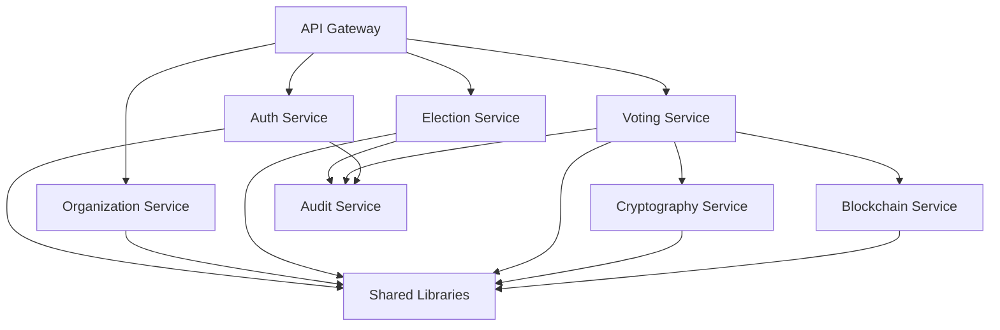

# EEMP Project Structure

**Last Updated:** 2026-08-01

---

## Directory Tree

```
e-voting-system/
├── README.md                          # Project overview and getting started
├── PROGRESS.md                        # Development progress tracker
├── PROJECT_STRUCTURE.md               # This file
├── .gitignore                         # Git ignore rules
│
├── docs/                              # Comprehensive documentation
│   ├── README.md                      # Documentation index
│   │
│   ├── requirements/                  # Business and system requirements
│   │   ├── 01-vision.md              # ✅ Vision document (15 pages)
│   │   ├── 02-brd.md                 # ✅ Business Requirements (20 pages)
│   │   ├── 03-srs.md                 # 📋 Software Requirements Specification
│   │   ├── 04-frs.md                 # 📋 Functional Requirements
│   │   └── 05-nfr.md                 # 📋 Non-Functional Requirements
│   │
│   ├── architecture/                  # System architecture
│   │   ├── 01-hld.md                 # ✅ High-Level Design (30+ pages)
│   │   ├── 02-lld.md                 # 📋 Low-Level Design
│   │   ├── 03-context-diagram.md     # 📋 System context
│   │   ├── 04-component-diagram.md   # 📋 Component architecture
│   │   ├── 05-deployment-architecture.md # 📋 Deployment design
│   │   ├── 06-multi-tenancy.md       # 📋 Multi-tenancy details
│   │   └── 07-event-architecture.md  # 📋 Event-driven patterns
│   │
│   ├── design/                        # Data and API design
│   │   ├── 01-database-schema.md     # 📋 PostgreSQL schema
│   │   ├── 02-data-dictionary.md     # 📋 Table/column specs
│   │   ├── 03-redis-design.md        # 📋 Caching strategy
│   │   ├── 04-object-storage.md      # 📋 S3 design
│   │   ├── 05-blockchain-model.md    # 📋 Solana data structures
│   │   └── 06-uml-diagrams.md        # 📋 Class, sequence, activity diagrams
│   │
│   ├── security/                      # Security architecture
│   │   ├── 01-security-architecture.md # 📋 Overall security design
│   │   ├── 02-authentication.md      # 📋 AuthN flows
│   │   ├── 03-authorization.md       # 📋 RBAC + ABAC
│   │   ├── 04-cryptography.md        # 📋 Crypto stack
│   │   ├── 05-threat-model.md        # 📋 STRIDE analysis
│   │   ├── 06-attack-trees.md        # 📋 Attack vectors
│   │   └── 07-security-testing.md    # 📋 Pentest strategy
│   │
│   ├── api/                           # API specifications
│   │   ├── 01-rest-api-design.md     # 📋 API design principles
│   │   ├── openapi.yaml              # 📋 OpenAPI 3.0 spec
│   │   ├── 02-api-authentication.md  # 📋 JWT implementation
│   │   ├── 03-rate-limiting.md       # 📋 Rate limit design
│   │   └── 04-webhooks.md            # 📋 Event notifications
│   │
│   └── deployment/                    # DevOps and deployment
│       ├── 01-devops-strategy.md     # 📋 CI/CD approach
│       ├── 02-docker.md              # 📋 Container design
│       ├── 03-kubernetes.md          # 📋 K8s architecture
│       ├── 04-monitoring.md          # 📋 Observability
│       ├── 05-disaster-recovery.md   # 📋 Backup/recovery
│       └── 06-deployment-guide.md    # 📋 Production deployment
│
├── backend/                           # Rust backend (Phase 1+)
│   ├── Cargo.toml                    # Workspace manifest
│   ├── Cargo.lock
│   │
│   ├── services/                      # Microservice-ready bounded contexts
│   │   ├── organization-service/     # Organization & multi-tenancy
│   │   │   ├── Cargo.toml
│   │   │   └── src/
│   │   │       ├── domain/           # Domain entities
│   │   │       ├── application/      # Use cases
│   │   │       ├── infrastructure/   # Repositories, adapters
│   │   │       └── lib.rs
│   │   │
│   │   ├── auth-service/             # Authentication & authorization
│   │   │   ├── Cargo.toml
│   │   │   └── src/
│   │   │       ├── domain/
│   │   │       ├── application/
│   │   │       ├── infrastructure/
│   │   │       └── lib.rs
│   │   │
│   │   ├── election-service/         # Election management
│   │   ├── voting-service/           # Vote casting
│   │   ├── candidate-service/        # Candidate management
│   │   ├── eligibility-service/      # Eligibility engine
│   │   ├── result-service/           # Result calculation
│   │   ├── audit-service/            # Audit logging
│   │   ├── notification-service/     # Email/SMS notifications
│   │   ├── analytics-service/        # Analytics & reporting
│   │   ├── cryptography-service/     # Cryptographic operations
│   │   └── blockchain-service/       # Solana integration
│   │
│   ├── shared/                        # Shared libraries
│   │   ├── domain-primitives/        # Common value objects (TenantId, UserId, etc.)
│   │   ├── error-handling/           # Error types and handlers
│   │   ├── observability/            # Logging, metrics, tracing
│   │   ├── config/                   # Configuration management
│   │   └── database/                 # Database utilities (connection pool, RLS)
│   │
│   ├── api-gateway/                   # Axum HTTP server
│   │   ├── Cargo.toml
│   │   └── src/
│   │       ├── handlers/             # HTTP handlers
│   │       ├── middleware/           # Auth, CORS, rate limiting
│   │       ├── routes.rs
│   │       └── main.rs
│   │
│   └── migrations/                    # SQLx migrations
│       ├── 001_create_organizations.sql
│       ├── 002_create_users.sql
│       ├── 003_create_elections.sql
│       └── ...
│
├── frontend/                          # Next.js application (Phase 5)
│   ├── package.json
│   ├── next.config.js
│   ├── tsconfig.json
│   ├── tailwind.config.js
│   │
│   ├── app/                           # Next.js 14 App Router
│   │   ├── layout.tsx                # Root layout
│   │   ├── page.tsx                  # Home page
│   │   ├── (auth)/                   # Auth routes
│   │   │   ├── login/
│   │   │   ├── register/
│   │   │   └── mfa/
│   │   ├── dashboard/                # Organization dashboard
│   │   ├── elections/                # Election management
│   │   ├── vote/                     # Voting interface
│   │   └── admin/                    # Admin panels
│   │
│   ├── components/                    # React components
│   │   ├── ui/                       # shadcn/ui components
│   │   ├── layouts/
│   │   ├── forms/
│   │   └── widgets/
│   │
│   ├── lib/                           # Utilities
│   │   ├── api-client.ts             # API wrapper
│   │   ├── auth.ts                   # Auth helpers
│   │   └── utils.ts
│   │
│   ├── hooks/                         # Custom React hooks
│   ├── store/                         # Zustand state management
│   └── public/                        # Static assets
│
├── blockchain/                        # Solana programs (Phase 3)
│   ├── Anchor.toml                   # Anchor config
│   ├── Cargo.toml
│   │
│   ├── programs/                      # Anchor programs
│   │   └── eemp-vote-commitment/     # Vote commitment program
│   │       ├── Cargo.toml
│   │       └── src/
│   │           ├── lib.rs            # Program entrypoint
│   │           ├── instructions/     # Program instructions
│   │           ├── state.rs          # Account structures
│   │           └── errors.rs         # Error codes
│   │
│   ├── tests/                         # Anchor tests
│   │   └── vote-commitment.ts
│   │
│   └── migrations/                    # Anchor deploy scripts
│
├── infrastructure/                    # DevOps & deployment (Phase 6)
│   ├── docker/                        # Docker configurations
│   │   ├── Dockerfile.backend        # Backend multi-stage build
│   │   ├── Dockerfile.frontend       # Frontend multi-stage build
│   │   └── docker-compose.yml        # Development environment
│   │
│   ├── kubernetes/                    # K8s manifests
│   │   ├── base/                     # Base configs
│   │   ├── overlays/
│   │   │   ├── development/
│   │   │   ├── staging/
│   │   │   └── production/
│   │   ├── deployments/              # Deployment specs
│   │   ├── services/                 # Service specs
│   │   ├── ingress/                  # Ingress rules
│   │   └── configmaps/               # ConfigMaps
│   │
│   ├── terraform/                     # Infrastructure as Code
│   │   ├── modules/
│   │   ├── environments/
│   │   │   ├── dev/
│   │   │   ├── staging/
│   │   │   └── production/
│   │   └── main.tf
│   │
│   └── monitoring/                    # Observability configs
│       ├── prometheus/               # Prometheus rules
│       ├── grafana/                  # Grafana dashboards
│       └── elk/                      # ELK Stack configs
│
├── tests/                             # Integration & E2E tests
│   ├── integration/                   # API integration tests
│   │   ├── auth_tests.rs
│   │   ├── election_tests.rs
│   │   └── voting_tests.rs
│   │
│   ├── e2e/                           # End-to-end tests (Playwright)
│   │   ├── auth.spec.ts
│   │   ├── election-creation.spec.ts
│   │   └── voting.spec.ts
│   │
│   ├── load/                          # Load tests (k6)
│   │   ├── vote-casting.js
│   │   └── api-load.js
│   │
│   └── security/                      # Security tests
│       ├── penetration/
│       └── vulnerability-scans/
│
├── scripts/                           # Utility scripts
│   ├── setup-dev.sh                  # Dev environment setup
│   ├── seed-data.sh                  # Database seeding
│   ├── backup.sh                     # Backup script
│   ├── deploy.sh                     # Deployment script
│   └── generate-api-docs.sh          # API doc generation
│
├── archive/                           # Archived code
│   └── legacy-2026-08-01/            # Original government-centric codebase
│
├── .github/                           # GitHub configuration
│   ├── workflows/                     # GitHub Actions CI/CD
│   │   ├── backend-ci.yml
│   │   ├── frontend-ci.yml
│   │   ├── blockchain-ci.yml
│   │   ├── security-scan.yml
│   │   └── deploy-production.yml
│   │
│   ├── ISSUE_TEMPLATE/
│   ├── PULL_REQUEST_TEMPLATE.md
│   └── dependabot.yml
│
└── .env.example                       # Environment variables template
```

---

## Key Design Patterns by Directory

### Backend Services (`backend/services/`)

**Pattern:** Clean Architecture + DDD

```
service/
  src/
    domain/              # Inner layer (business logic)
      entities/          # Core domain entities
      value_objects/     # Immutable value types
      aggregates/        # Aggregate roots
      domain_events/     # Domain events
      repositories/      # Repository traits (interfaces)
      services/          # Domain services (pure logic)
    
    application/         # Use case orchestration
      use_cases/         # Application use cases
      dto/               # Data Transfer Objects
      commands/          # CQRS commands
      queries/           # CQRS queries
    
    infrastructure/      # Outer layer (adapters)
      repositories/      # Repository implementations (PostgreSQL)
      adapters/          # External service adapters
      persistence/       # Database models
```

**Dependency Rule:** Dependencies point inward only (infra → app → domain)

---

### Frontend (`frontend/`)

**Pattern:** Feature-based organization

```
app/
  (feature)/           # Route groups
    page.tsx           # Route page
    layout.tsx         # Shared layout
    loading.tsx        # Loading state
    error.tsx          # Error boundary
    
components/
  ui/                  # Atomic UI components (shadcn/ui)
  feature-name/        # Feature-specific components
  
lib/
  api/                 # API client functions
  hooks/               # Custom hooks
  utils/               # Utility functions
```

---

### Infrastructure (`infrastructure/`)

**Pattern:** Environment-based overlays

```
kubernetes/
  base/                # Common configs (all environments)
  overlays/
    development/       # Dev-specific overrides
    staging/           # Staging-specific
    production/        # Production-specific (scaled)
```

Uses Kustomize for environment management.

---

## File Naming Conventions

### Documentation
- **Format:** Markdown (`.md`)
- **Naming:** `##-descriptive-name.md` (e.g., `01-vision.md`)
- **Diagrams:** Mermaid syntax embedded in Markdown

### Backend (Rust)
- **Modules:** `snake_case` (e.g., `organization_service`)
- **Files:** `snake_case.rs` (e.g., `user_repository.rs`)
- **Structs/Enums:** `PascalCase` (e.g., `struct Election`)
- **Functions:** `snake_case` (e.g., `fn create_election()`)

### Frontend (TypeScript)
- **Components:** `PascalCase.tsx` (e.g., `ElectionCard.tsx`)
- **Utilities:** `camelCase.ts` (e.g., `apiClient.ts`)
- **Hooks:** `use` prefix (e.g., `useAuth.ts`)
- **Constants:** `UPPER_SNAKE_CASE` (e.g., `API_BASE_URL`)

### Configuration
- **Docker:** `Dockerfile.<service>` (e.g., `Dockerfile.backend`)
- **Kubernetes:** `<resource>-<name>.yaml` (e.g., `deployment-api.yaml`)
- **Environment:** `.env.example`, `.env.local`, `.env.production`

---

## Branch Strategy

```
main                   # Production-ready code
  └─ develop           # Integration branch
       ├─ feature/*    # Feature branches (feature/auth-service)
       ├─ bugfix/*     # Bug fixes
       ├─ hotfix/*     # Production hotfixes
       └─ docs/*       # Documentation updates
```

**Workflow:**
1. Create feature branch from `develop`
2. Implement with tests
3. PR to `develop` (requires review + CI passing)
4. Release: PR from `develop` to `main`

---

## Module Dependencies



**Rule:** Services only depend on shared libraries, not on each other (loose coupling).

---

## Status Legend

- ✅ **Complete** - Implemented and reviewed
- 🔄 **In Progress** - Currently being developed
- 📋 **Planned** - Scheduled for future implementation
- ⏸️ **On Hold** - Deprioritized
- ❌ **Blocked** - Waiting on dependencies

---

## Quick Navigation

| What You Need | Where to Find It |
|---------------|------------------|
| **Project overview** | `README.md` |
| **Development status** | `PROGRESS.md` |
| **Directory structure** | This file (`PROJECT_STRUCTURE.md`) |
| **Architecture diagrams** | `docs/architecture/` |
| **Database schema** | `docs/design/01-database-schema.md` (when complete) |
| **API documentation** | `docs/api/openapi.yaml` (when complete) |
| **Security design** | `docs/security/` |
| **Deployment guides** | `docs/deployment/` |
| **Backend code** | `backend/` (Phase 1+) |
| **Frontend code** | `frontend/` (Phase 5) |
| **Infrastructure configs** | `infrastructure/` (Phase 6) |

---

**Last Updated:** 2026-08-01  
**Maintained By:** EEMP Architecture Team
