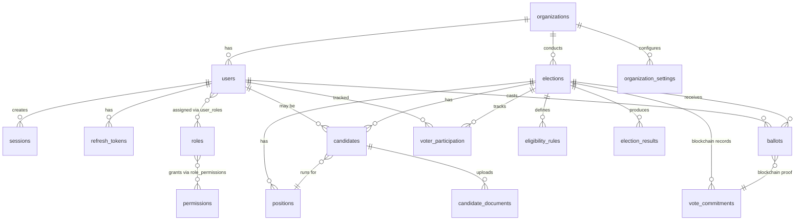

# Database Schema Design
## Enterprise Election Management Platform (EEMP)

**Document Version:** 1.0  
**Last Updated:** 2026-08-01  
**Status:** Draft  
**Classification:** Internal

---

## Document Control

| Field | Value |
|-------|-------|
| **Document Type** | Database Schema Design |
| **Owner** | Database Architect + Backend Lead |
| **Reviewers** | CTO, Security Architect, Lead Engineers |
| **Approvers** | CTO, Database Architect |
| **Target Audience** | Backend engineers, database administrators, architects |

---

## Table of Contents

1. [Introduction](#1-introduction)
2. [Multi-Tenancy Strategy](#2-multi-tenancy-strategy)
3. [Schema Overview](#3-schema-overview)
4. [Core Tables](#4-core-tables)
5. [Indexes and Constraints](#5-indexes-and-constraints)
6. [Row-Level Security Policies](#6-row-level-security-policies)
7. [Data Partitioning](#7-data-partitioning)
8. [Migration Strategy](#8-migration-strategy)
9. [Performance Considerations](#9-performance-considerations)
10. [Backup and Recovery](#10-backup-and-recovery)

---

## 1. Introduction

### 1.1 Purpose

This document defines the PostgreSQL database schema for EEMP, including table structures, relationships, indexes, constraints, and Row-Level Security policies for multi-tenancy.

### 1.2 Database Technology

- **Database:** PostgreSQL 16+
- **Rationale:** ACID compliance, JSONB support, Row-Level Security, proven scalability
- **Connection Management:** SQLx connection pool (10-100 connections)
- **Encoding:** UTF-8

### 1.3 Design Principles

1. **Multi-Tenancy:** Complete data isolation using Row-Level Security (RLS)
2. **Normalization:** Third Normal Form (3NF) with selective denormalization for performance
3. **UUID Primary Keys:** Universally unique identifiers for distributed systems
4. **Timestamps:** All tables include `created_at`, `updated_at` (UTC)
5. **Soft Deletes:** Important entities use `deleted_at` instead of hard deletes
6. **Audit Trail:** Every mutation logged in audit table
7. **JSONB for Flexibility:** Use JSONB for semi-structured data (settings, metadata)

### 1.4 Naming Conventions

- **Tables:** Lowercase, plural nouns, snake_case (e.g., `organizations`, `election_results`)
- **Columns:** Lowercase, snake_case (e.g., `full_name`, `created_at`)
- **Foreign Keys:** `{table_singular}_id` (e.g., `organization_id`, `user_id`)
- **Indexes:** `idx_{table}_{column(s)}` (e.g., `idx_users_email`)
- **Unique Constraints:** `uniq_{table}_{column(s)}` (e.g., `uniq_users_tenant_email`)
- **Check Constraints:** `chk_{table}_{description}` (e.g., `chk_elections_dates_valid`)

---

## 2. Multi-Tenancy Strategy

### 2.1 Approach: Shared Database with Row-Level Security

**Design Decision:**
- Single PostgreSQL database
- All tenant data in shared tables
- `tenant_id` column in every tenant-scoped table
- PostgreSQL Row-Level Security (RLS) enforces isolation

**Benefits:**
- Cost-effective (single database cluster)
- Simplified operations (one backup, one migration)
- Strong isolation (database-enforced, not application-enforced)
- Scalable (can shard by tenant_id if needed)

**Alternatives Considered:**
- ❌ Database-per-tenant: Too expensive, operational complexity
- ❌ Schema-per-tenant: Better but still complex, harder migrations

### 2.2 Tenant Resolution

**Application Flow:**
```sql
-- 1. Extract tenant from request (subdomain, custom domain, or header)
-- 2. Set session variable
SET LOCAL app.current_tenant_id = '550e8400-e29b-41d4-a716-446655440000';

-- 3. All subsequent queries automatically filtered by RLS policy
SELECT * FROM elections;  -- Only returns elections for current tenant
```

**RLS Policy Example:**
```sql
CREATE POLICY tenant_isolation ON elections
    USING (tenant_id = current_setting('app.current_tenant_id')::UUID);
```

### 2.3 Tenant-Scoped vs Global Tables

**Tenant-Scoped Tables** (include `tenant_id`):
- organizations (tenant master table, `id` IS the tenant_id)
- users
- elections
- candidates
- ballots
- vote_commitments
- positions
- eligibility_rules
- voter_participation
- election_results

**Global Tables** (NO `tenant_id`):
- audit_logs (include tenant_id for filtering, but not RLS-protected to allow platform admin access)
- refresh_tokens (user_scoped, inherits tenant via user relationship)
- sessions (user-scoped, inherits tenant via user relationship)

---

## 3. Schema Overview

### 3.1 Entity Relationship Diagram (High-Level)



### 3.2 Table Categories

#### Organization & Tenant Management (3 tables)
- organizations
- organization_settings
- organization_templates

#### User & Authentication (6 tables)
- users
- roles
- permissions
- user_roles
- role_permissions
- sessions
- refresh_tokens

#### Election Management (5 tables)
- elections
- election_types
- positions
- eligibility_rules
- election_state_history

#### Candidate Management (3 tables)
- candidates
- candidate_profiles
- candidate_documents

#### Voting (4 tables)
- ballots
- vote_commitments
- voter_participation
- encrypted_ballots (future: separate table for very large elections)

#### Results (2 tables)
- election_results
- result_reports

#### Audit & Analytics (2 tables)
- audit_logs
- analytics_events

**Total: 25+ tables**

---

## 4. Core Tables

### 4.1 Organizations

**Purpose:** Tenant master table. Each organization is a tenant.

```sql
CREATE TABLE organizations (
    id UUID PRIMARY KEY DEFAULT gen_random_uuid(),
    name VARCHAR(255) NOT NULL,
    slug VARCHAR(63) NOT NULL UNIQUE,  -- subdomain, e.g., "stanford"
    organization_type VARCHAR(100) NOT NULL,  -- 'university', 'company', 'ngo', etc.
    
    -- Contact Information
    domain VARCHAR(255),  -- custom domain (future)
    website VARCHAR(500),
    contact_email VARCHAR(255),
    contact_phone VARCHAR(50),
    
    -- Status
    status VARCHAR(50) NOT NULL DEFAULT 'active',  -- 'active', 'suspended', 'deleted'
    email_verified BOOLEAN NOT NULL DEFAULT FALSE,
    
    -- Branding
    logo_url TEXT,
    primary_color VARCHAR(7),  -- hex color, e.g., "#3B82F6"
    secondary_color VARCHAR(7),
    
    -- Metadata
    metadata JSONB DEFAULT '{}',  -- flexible storage for org-specific data
    
    -- Timestamps
    created_at TIMESTAMPTZ NOT NULL DEFAULT NOW(),
    updated_at TIMESTAMPTZ NOT NULL DEFAULT NOW(),
    deleted_at TIMESTAMPTZ,  -- soft delete
    
    -- Constraints
    CONSTRAINT chk_organizations_slug_format CHECK (slug ~ '^[a-z0-9-]{3,63}$'),
    CONSTRAINT chk_organizations_colors_valid CHECK (
        primary_color IS NULL OR primary_color ~ '^#[0-9A-Fa-f]{6}$'
    )
);

-- Indexes
CREATE INDEX idx_organizations_slug ON organizations(slug);
CREATE INDEX idx_organizations_status ON organizations(status) WHERE deleted_at IS NULL;
CREATE INDEX idx_organizations_created_at ON organizations(created_at);

-- Trigger for updated_at
CREATE TRIGGER set_organizations_updated_at
    BEFORE UPDATE ON organizations
    FOR EACH ROW
    EXECUTE FUNCTION update_updated_at_column();
```

**Notes:**
- `id` serves as `tenant_id` throughout the system
- `slug` is used for subdomain routing (e.g., `{slug}.eemp.app`)
- `organization_type` can be extended with custom values
- `metadata` JSONB allows storing org-specific configuration without schema changes

---

### 4.2 Organization Settings

**Purpose:** Store organization-specific configuration and preferences.

```sql
CREATE TABLE organization_settings (
    id UUID PRIMARY KEY DEFAULT gen_random_uuid(),
    organization_id UUID NOT NULL REFERENCES organizations(id) ON DELETE CASCADE,
    
    -- Settings
    timezone VARCHAR(100) DEFAULT 'UTC',
    date_format VARCHAR(50) DEFAULT 'YYYY-MM-DD',
    language VARCHAR(10) DEFAULT 'en',  -- future i18n
    
    -- Feature Toggles
    allow_voter_self_registration BOOLEAN DEFAULT FALSE,
    require_mfa BOOLEAN DEFAULT FALSE,
    require_election_approval BOOLEAN DEFAULT TRUE,
    allow_candidate_self_nomination BOOLEAN DEFAULT FALSE,
    public_results_default BOOLEAN DEFAULT TRUE,
    
    -- Election Defaults
    default_election_duration_hours INTEGER DEFAULT 24,
    candidate_registration_cutoff_hours INTEGER DEFAULT 24,
    
    -- Data Retention
    audit_log_retention_years INTEGER DEFAULT 7,
    election_data_retention_years INTEGER DEFAULT 7,
    
    -- Custom Settings
    custom_settings JSONB DEFAULT '{}',
    
    -- Timestamps
    created_at TIMESTAMPTZ NOT NULL DEFAULT NOW(),
    updated_at TIMESTAMPTZ NOT NULL DEFAULT NOW(),
    
    -- Constraints
    CONSTRAINT uniq_organization_settings_org UNIQUE(organization_id)
);

-- Indexes
CREATE INDEX idx_organization_settings_org_id ON organization_settings(organization_id);
```

---

### 4.3 Users

**Purpose:** User accounts within organizations (tenant-scoped).

```sql
CREATE TABLE users (
    id UUID PRIMARY KEY DEFAULT gen_random_uuid(),
    tenant_id UUID NOT NULL REFERENCES organizations(id) ON DELETE CASCADE,
    
    -- Authentication
    email VARCHAR(255) NOT NULL,
    password_hash VARCHAR(255) NOT NULL,  -- Argon2id
    full_name VARCHAR(255) NOT NULL,
    
    -- Status
    status VARCHAR(50) NOT NULL DEFAULT 'pending_verification',  -- 'pending_verification', 'active', 'suspended', 'deleted'
    email_verified BOOLEAN NOT NULL DEFAULT FALSE,
    email_verification_token VARCHAR(255),
    email_verification_expires_at TIMESTAMPTZ,
    
    -- Password Management
    password_reset_token VARCHAR(255),
    password_reset_expires_at TIMESTAMPTZ,
    password_changed_at TIMESTAMPTZ,
    must_change_password BOOLEAN NOT NULL DEFAULT FALSE,
    
    -- MFA
    mfa_enabled BOOLEAN NOT NULL DEFAULT FALSE,
    mfa_secret VARCHAR(255),  -- encrypted TOTP secret
    mfa_backup_codes TEXT[],  -- array of encrypted backup codes
    
    -- Security
    failed_login_attempts INTEGER NOT NULL DEFAULT 0,
    locked_until TIMESTAMPTZ,
    last_login_at TIMESTAMPTZ,
    last_login_ip INET,
    
    -- User Attributes (for eligibility rules)
    user_attributes JSONB DEFAULT '{}',  -- e.g., {"department": "Engineering", "enrollment_year": 2023}
    
    -- Metadata
    metadata JSONB DEFAULT '{}',
    
    -- Timestamps
    created_at TIMESTAMPTZ NOT NULL DEFAULT NOW(),
    updated_at TIMESTAMPTZ NOT NULL DEFAULT NOW(),
    deleted_at TIMESTAMPTZ,  -- soft delete
    
    -- Constraints
    CONSTRAINT uniq_users_tenant_email UNIQUE(tenant_id, email),
    CONSTRAINT chk_users_email_format CHECK (email ~* '^[A-Za-z0-9._%+-]+@[A-Za-z0-9.-]+\.[A-Za-z]{2,}$')
);

-- Indexes
CREATE INDEX idx_users_tenant_id ON users(tenant_id) WHERE deleted_at IS NULL;
CREATE INDEX idx_users_email ON users(email);
CREATE INDEX idx_users_status ON users(status) WHERE deleted_at IS NULL;
CREATE INDEX idx_users_email_verified ON users(email_verified);
CREATE INDEX idx_users_last_login_at ON users(last_login_at);
CREATE INDEX idx_users_user_attributes ON users USING GIN(user_attributes);  -- GIN index for JSONB queries

-- Row-Level Security
ALTER TABLE users ENABLE ROW LEVEL SECURITY;

CREATE POLICY tenant_isolation ON users
    USING (tenant_id = current_setting('app.current_tenant_id')::UUID);

-- Trigger for updated_at
CREATE TRIGGER set_users_updated_at
    BEFORE UPDATE ON users
    FOR EACH ROW
    EXECUTE FUNCTION update_updated_at_column();
```

**Notes:**
- Email uniqueness is enforced per tenant (not globally)
- `user_attributes` JSONB stores flexible attributes for eligibility rules (e.g., department, grade, membership status)
- MFA secret and backup codes stored encrypted
- `failed_login_attempts` and `locked_until` support rate limiting

---

### 4.4 Roles

**Purpose:** Define roles for RBAC within organizations.

```sql
CREATE TABLE roles (
    id UUID PRIMARY KEY DEFAULT gen_random_uuid(),
    tenant_id UUID NOT NULL REFERENCES organizations(id) ON DELETE CASCADE,
    
    name VARCHAR(100) NOT NULL,
    description TEXT,
    
    -- System vs Custom
    is_system_role BOOLEAN NOT NULL DEFAULT FALSE,  -- system roles cannot be deleted
    
    -- Metadata
    metadata JSONB DEFAULT '{}',
    
    -- Timestamps
    created_at TIMESTAMPTZ NOT NULL DEFAULT NOW(),
    updated_at TIMESTAMPTZ NOT NULL DEFAULT NOW(),
    
    -- Constraints
    CONSTRAINT uniq_roles_tenant_name UNIQUE(tenant_id, name)
);

-- Indexes
CREATE INDEX idx_roles_tenant_id ON roles(tenant_id);
CREATE INDEX idx_roles_name ON roles(name);

-- Row-Level Security
ALTER TABLE roles ENABLE ROW LEVEL SECURITY;

CREATE POLICY tenant_isolation ON roles
    USING (tenant_id = current_setting('app.current_tenant_id')::UUID);

-- Default Roles (inserted on organization creation)
-- 'Organization Owner', 'Organization Admin', 'Election Manager', 'Election Officer', 
-- 'Voter', 'Candidate', 'Auditor', 'Observer'
```

---

### 4.5 Permissions

**Purpose:** Define granular permissions for RBAC.

```sql
CREATE TABLE permissions (
    id UUID PRIMARY KEY DEFAULT gen_random_uuid(),
    
    name VARCHAR(100) NOT NULL UNIQUE,  -- e.g., 'election:create', 'vote:cast'
    resource VARCHAR(100) NOT NULL,  -- e.g., 'election', 'vote', 'user'
    action VARCHAR(100) NOT NULL,  -- e.g., 'create', 'read', 'update', 'delete'
    description TEXT,
    
    -- Timestamps
    created_at TIMESTAMPTZ NOT NULL DEFAULT NOW(),
    
    -- Constraints
    CONSTRAINT uniq_permissions_resource_action UNIQUE(resource, action)
);

-- Indexes
CREATE INDEX idx_permissions_name ON permissions(name);
CREATE INDEX idx_permissions_resource ON permissions(resource);

-- Permissions are global (not tenant-scoped)
-- Examples:
-- ('organization:read', 'organization', 'read')
-- ('organization:write', 'organization', 'write')
-- ('election:create', 'election', 'create')
-- ('election:update', 'election', 'update')
-- ('vote:cast', 'vote', 'cast')
-- ('result:publish', 'result', 'publish')
-- ('audit:read', 'audit', 'read')
```

---

### 4.6 User Roles (Junction Table)

```sql
CREATE TABLE user_roles (
    id UUID PRIMARY KEY DEFAULT gen_random_uuid(),
    tenant_id UUID NOT NULL REFERENCES organizations(id) ON DELETE CASCADE,
    user_id UUID NOT NULL REFERENCES users(id) ON DELETE CASCADE,
    role_id UUID NOT NULL REFERENCES roles(id) ON DELETE CASCADE,
    
    assigned_by UUID REFERENCES users(id),  -- who assigned this role
    assigned_at TIMESTAMPTZ NOT NULL DEFAULT NOW(),
    
    -- Timestamps
    created_at TIMESTAMPTZ NOT NULL DEFAULT NOW(),
    
    -- Constraints
    CONSTRAINT uniq_user_roles_user_role UNIQUE(user_id, role_id)
);

-- Indexes
CREATE INDEX idx_user_roles_user_id ON user_roles(user_id);
CREATE INDEX idx_user_roles_role_id ON user_roles(role_id);
CREATE INDEX idx_user_roles_tenant_id ON user_roles(tenant_id);

-- Row-Level Security
ALTER TABLE user_roles ENABLE ROW LEVEL SECURITY;

CREATE POLICY tenant_isolation ON user_roles
    USING (tenant_id = current_setting('app.current_tenant_id')::UUID);
```

---

### 4.7 Role Permissions (Junction Table)

```sql
CREATE TABLE role_permissions (
    id UUID PRIMARY KEY DEFAULT gen_random_uuid(),
    role_id UUID NOT NULL REFERENCES roles(id) ON DELETE CASCADE,
    permission_id UUID NOT NULL REFERENCES permissions(id) ON DELETE CASCADE,
    
    -- Timestamps
    created_at TIMESTAMPTZ NOT NULL DEFAULT NOW(),
    
    -- Constraints
    CONSTRAINT uniq_role_permissions_role_perm UNIQUE(role_id, permission_id)
);

-- Indexes
CREATE INDEX idx_role_permissions_role_id ON role_permissions(role_id);
CREATE INDEX idx_role_permissions_permission_id ON role_permissions(permission_id);
```

---

### 4.8 Sessions

**Purpose:** Track active user sessions (also cached in Redis).

```sql
CREATE TABLE sessions (
    id UUID PRIMARY KEY DEFAULT gen_random_uuid(),
    user_id UUID NOT NULL REFERENCES users(id) ON DELETE CASCADE,
    
    -- Session Data
    token_jti VARCHAR(255) NOT NULL UNIQUE,  -- JWT token ID (for revocation)
    ip_address INET,
    user_agent TEXT,
    
    -- Expiration
    expires_at TIMESTAMPTZ NOT NULL,
    
    -- Timestamps
    created_at TIMESTAMPTZ NOT NULL DEFAULT NOW(),
    last_accessed_at TIMESTAMPTZ NOT NULL DEFAULT NOW()
);

-- Indexes
CREATE INDEX idx_sessions_user_id ON sessions(user_id);
CREATE INDEX idx_sessions_token_jti ON sessions(token_jti);
CREATE INDEX idx_sessions_expires_at ON sessions(expires_at);
CREATE INDEX idx_sessions_created_at ON sessions(created_at);

-- Cleanup job: DELETE FROM sessions WHERE expires_at < NOW() - INTERVAL '1 day';
```

**Notes:**
- Sessions also cached in Redis (TTL 15 minutes)
- PostgreSQL sessions used for revocation checks and audit
- Old sessions cleaned up daily

---

### 4.9 Refresh Tokens

**Purpose:** Long-lived refresh tokens for JWT refresh flow.

```sql
CREATE TABLE refresh_tokens (
    id UUID PRIMARY KEY DEFAULT gen_random_uuid(),
    user_id UUID NOT NULL REFERENCES users(id) ON DELETE CASCADE,
    
    -- Token
    token_hash VARCHAR(255) NOT NULL UNIQUE,  -- SHA-256 hash of token
    
    -- Status
    revoked BOOLEAN NOT NULL DEFAULT FALSE,
    revoked_at TIMESTAMPTZ,
    revoked_reason TEXT,
    
    -- Device Information
    device_name VARCHAR(255),
    ip_address INET,
    user_agent TEXT,
    
    -- Expiration
    expires_at TIMESTAMPTZ NOT NULL,
    
    -- Timestamps
    created_at TIMESTAMPTZ NOT NULL DEFAULT NOW(),
    last_used_at TIMESTAMPTZ NOT NULL DEFAULT NOW()
);

-- Indexes
CREATE INDEX idx_refresh_tokens_user_id ON refresh_tokens(user_id);
CREATE INDEX idx_refresh_tokens_token_hash ON refresh_tokens(token_hash);
CREATE INDEX idx_refresh_tokens_expires_at ON refresh_tokens(expires_at);
CREATE INDEX idx_refresh_tokens_revoked ON refresh_tokens(revoked);

-- Cleanup job: DELETE FROM refresh_tokens WHERE expires_at < NOW() OR revoked = TRUE AND revoked_at < NOW() - INTERVAL '30 days';
```

---

### 4.10 Elections

**Purpose:** Election master table.

```sql
CREATE TABLE elections (
    id UUID PRIMARY KEY DEFAULT gen_random_uuid(),
    tenant_id UUID NOT NULL REFERENCES organizations(id) ON DELETE CASCADE,
    
    -- Basic Information
    title VARCHAR(255) NOT NULL,
    description TEXT,
    election_type VARCHAR(100) NOT NULL,  -- 'individual', 'post_wise', 'panel', 'ranked_choice'
    
    -- Status and State
    status VARCHAR(50) NOT NULL DEFAULT 'draft',  -- 'draft', 'review', 'scheduled', 'open', 'closed', 'verifying', 'published', 'archived'
    
    -- Schedule
    start_time TIMESTAMPTZ NOT NULL,
    end_time TIMESTAMPTZ NOT NULL,
    
    -- Settings
    settings JSONB DEFAULT '{}',  -- flexible settings (anonymous_voting, public_results, etc.)
    
    -- Eligibility
    eligibility_config JSONB DEFAULT '{}',  -- eligibility rules configuration
    
    -- Cryptography
    election_public_key TEXT,  -- X25519 public key (for ballot encryption)
    election_private_key_encrypted TEXT,  -- encrypted with master key
    election_authority_key_pair JSONB,  -- Ed25519 key pair (for signing)
    
    -- Created By
    created_by UUID NOT NULL REFERENCES users(id),
    
    -- Metadata
    metadata JSONB DEFAULT '{}',
    
    -- Timestamps
    created_at TIMESTAMPTZ NOT NULL DEFAULT NOW(),
    updated_at TIMESTAMPTZ NOT NULL DEFAULT NOW(),
    deleted_at TIMESTAMPTZ,  -- soft delete
    
    -- Constraints
    CONSTRAINT chk_elections_dates_valid CHECK (end_time > start_time),
    CONSTRAINT chk_elections_status_valid CHECK (status IN ('draft', 'review', 'scheduled', 'open', 'closed', 'verifying', 'published', 'archived'))
);

-- Indexes
CREATE INDEX idx_elections_tenant_id ON elections(tenant_id) WHERE deleted_at IS NULL;
CREATE INDEX idx_elections_status ON elections(status) WHERE deleted_at IS NULL;
CREATE INDEX idx_elections_start_time ON elections(start_time);
CREATE INDEX idx_elections_end_time ON elections(end_time);
CREATE INDEX idx_elections_created_by ON elections(created_by);
CREATE INDEX idx_elections_created_at ON elections(created_at);

-- Row-Level Security
ALTER TABLE elections ENABLE ROW LEVEL SECURITY;

CREATE POLICY tenant_isolation ON elections
    USING (tenant_id = current_setting('app.current_tenant_id')::UUID);

-- Trigger for updated_at
CREATE TRIGGER set_elections_updated_at
    BEFORE UPDATE ON elections
    FOR EACH ROW
    EXECUTE FUNCTION update_updated_at_column();
```

**Notes:**
- `settings` JSONB stores election-specific configuration
- Cryptographic keys stored (public key in plain, private key encrypted)
- State machine enforced at application layer (with audit trail)

---

### 4.11 Election State History

**Purpose:** Track election state transitions (audit trail).

```sql
CREATE TABLE election_state_history (
    id UUID PRIMARY KEY DEFAULT gen_random_uuid(),
    tenant_id UUID NOT NULL REFERENCES organizations(id) ON DELETE CASCADE,
    election_id UUID NOT NULL REFERENCES elections(id) ON DELETE CASCADE,
    
    -- State Transition
    from_state VARCHAR(50),  -- NULL for initial state
    to_state VARCHAR(50) NOT NULL,
    
    -- Actor
    changed_by UUID REFERENCES users(id),  -- NULL for automatic transitions
    transition_type VARCHAR(50) NOT NULL,  -- 'manual', 'automatic', 'scheduled'
    
    -- Reason (for manual transitions, especially reversals)
    reason TEXT,
    
    -- Timestamp
    transitioned_at TIMESTAMPTZ NOT NULL DEFAULT NOW()
);

-- Indexes
CREATE INDEX idx_election_state_history_election_id ON election_state_history(election_id);
CREATE INDEX idx_election_state_history_tenant_id ON election_state_history(tenant_id);
CREATE INDEX idx_election_state_history_transitioned_at ON election_state_history(transitioned_at);

-- Row-Level Security
ALTER TABLE election_state_history ENABLE ROW LEVEL SECURITY;

CREATE POLICY tenant_isolation ON election_state_history
    USING (tenant_id = current_setting('app.current_tenant_id')::UUID);
```

---

### 4.12 Positions

**Purpose:** Define positions within elections (for post-wise elections).

```sql
CREATE TABLE positions (
    id UUID PRIMARY KEY DEFAULT gen_random_uuid(),
    tenant_id UUID NOT NULL REFERENCES organizations(id) ON DELETE CASCADE,
    election_id UUID NOT NULL REFERENCES elections(id) ON DELETE CASCADE,
    
    -- Position Details
    name VARCHAR(255) NOT NULL,  -- e.g., "President", "Secretary"
    description TEXT,
    display_order INTEGER NOT NULL DEFAULT 0,  -- for ordering positions on ballot
    
    -- Voting Rules
    seats_available INTEGER NOT NULL DEFAULT 1,  -- number of winners
    votes_allowed INTEGER NOT NULL DEFAULT 1,  -- how many candidates voter can select
    
    -- Metadata
    metadata JSONB DEFAULT '{}',
    
    -- Timestamps
    created_at TIMESTAMPTZ NOT NULL DEFAULT NOW(),
    updated_at TIMESTAMPTZ NOT NULL DEFAULT NOW(),
    
    -- Constraints
    CONSTRAINT chk_positions_seats_positive CHECK (seats_available > 0),
    CONSTRAINT chk_positions_votes_positive CHECK (votes_allowed > 0)
);

-- Indexes
CREATE INDEX idx_positions_election_id ON positions(election_id);
CREATE INDEX idx_positions_tenant_id ON positions(tenant_id);
CREATE INDEX idx_positions_display_order ON positions(display_order);

-- Row-Level Security
ALTER TABLE positions ENABLE ROW LEVEL SECURITY;

CREATE POLICY tenant_isolation ON positions
    USING (tenant_id = current_setting('app.current_tenant_id')::UUID);

-- Trigger for updated_at
CREATE TRIGGER set_positions_updated_at
    BEFORE UPDATE ON positions
    FOR EACH ROW
    EXECUTE FUNCTION update_updated_at_column();
```

---

### 4.13 Eligibility Rules

**Purpose:** Define voter eligibility criteria for elections.

```sql
CREATE TABLE eligibility_rules (
    id UUID PRIMARY KEY DEFAULT gen_random_uuid(),
    tenant_id UUID NOT NULL REFERENCES organizations(id) ON DELETE CASCADE,
    election_id UUID NOT NULL REFERENCES elections(id) ON DELETE CASCADE,
    
    -- Rule Configuration
    rule_type VARCHAR(100) NOT NULL,  -- 'all_members', 'attribute_based', 'custom_list', 'expression'
    rule_config JSONB NOT NULL,  -- rule-specific configuration
    
    -- Examples:
    -- rule_type='all_members': rule_config={}
    -- rule_type='attribute_based': rule_config={"department": "Engineering"}
    -- rule_type='expression': rule_config={"expression": "department == 'Engineering' AND tenure > 1"}
    -- rule_type='custom_list': rule_config={"voter_ids": ["uuid1", "uuid2", ...]}
    
    -- Description
    description TEXT,
    
    -- Timestamps
    created_at TIMESTAMPTZ NOT NULL DEFAULT NOW(),
    updated_at TIMESTAMPTZ NOT NULL DEFAULT NOW()
);

-- Indexes
CREATE INDEX idx_eligibility_rules_election_id ON eligibility_rules(election_id);
CREATE INDEX idx_eligibility_rules_tenant_id ON eligibility_rules(tenant_id);

-- Row-Level Security
ALTER TABLE eligibility_rules ENABLE ROW LEVEL SECURITY;

CREATE POLICY tenant_isolation ON eligibility_rules
    USING (tenant_id = current_setting('app.current_tenant_id')::UUID);

-- Trigger for updated_at
CREATE TRIGGER set_eligibility_rules_updated_at
    BEFORE UPDATE ON eligibility_rules
    FOR EACH ROW
    EXECUTE FUNCTION update_updated_at_column();
```

---

### 4.14 Candidates

**Purpose:** Candidate registrations for elections.

```sql
CREATE TABLE candidates (
    id UUID PRIMARY KEY DEFAULT gen_random_uuid(),
    tenant_id UUID NOT NULL REFERENCES organizations(id) ON DELETE CASCADE,
    election_id UUID NOT NULL REFERENCES elections(id) ON DELETE CASCADE,
    position_id UUID REFERENCES positions(id) ON DELETE CASCADE,  -- NULL for non-post-wise elections
    
    -- Candidate Identity
    user_id UUID REFERENCES users(id) ON DELETE SET NULL,  -- may or may not have user account
    full_name VARCHAR(255) NOT NULL,
    
    -- Profile
    biography TEXT,
    photo_url TEXT,
    
    -- Verification
    verification_status VARCHAR(50) NOT NULL DEFAULT 'pending',  -- 'pending', 'approved', 'rejected'
    verified_by UUID REFERENCES users(id),
    verified_at TIMESTAMPTZ,
    rejection_reason TEXT,
    
    -- Metadata
    metadata JSONB DEFAULT '{}',
    
    -- Timestamps
    created_at TIMESTAMPTZ NOT NULL DEFAULT NOW(),
    updated_at TIMESTAMPTZ NOT NULL DEFAULT NOW(),
    deleted_at TIMESTAMPTZ,  -- soft delete
    
    -- Constraints
    CONSTRAINT chk_candidates_verification_status CHECK (verification_status IN ('pending', 'approved', 'rejected'))
);

-- Indexes
CREATE INDEX idx_candidates_election_id ON candidates(election_id) WHERE deleted_at IS NULL;
CREATE INDEX idx_candidates_position_id ON candidates(position_id);
CREATE INDEX idx_candidates_tenant_id ON candidates(tenant_id) WHERE deleted_at IS NULL;
CREATE INDEX idx_candidates_user_id ON candidates(user_id);
CREATE INDEX idx_candidates_verification_status ON candidates(verification_status);

-- Row-Level Security
ALTER TABLE candidates ENABLE ROW LEVEL SECURITY;

CREATE POLICY tenant_isolation ON candidates
    USING (tenant_id = current_setting('app.current_tenant_id')::UUID);

-- Trigger for updated_at
CREATE TRIGGER set_candidates_updated_at
    BEFORE UPDATE ON candidates
    FOR EACH ROW
    EXECUTE FUNCTION update_updated_at_column();
```

---

### 4.15 Candidate Documents

**Purpose:** Store references to uploaded candidate documents (stored in S3).

```sql
CREATE TABLE candidate_documents (
    id UUID PRIMARY KEY DEFAULT gen_random_uuid(),
    tenant_id UUID NOT NULL REFERENCES organizations(id) ON DELETE CASCADE,
    candidate_id UUID NOT NULL REFERENCES candidates(id) ON DELETE CASCADE,
    
    -- Document Details
    document_type VARCHAR(100) NOT NULL,  -- 'nomination_form', 'citizenship_proof', 'education_proof', etc.
    file_name VARCHAR(255) NOT NULL,
    file_size_bytes BIGINT NOT NULL,
    mime_type VARCHAR(100) NOT NULL,
    
    -- Storage
    storage_path TEXT NOT NULL,  -- S3 path
    storage_bucket VARCHAR(255) NOT NULL,
    
    -- Access
    is_public BOOLEAN NOT NULL DEFAULT FALSE,
    
    -- Upload Information
    uploaded_by UUID NOT NULL REFERENCES users(id),
    
    -- Timestamps
    created_at TIMESTAMPTZ NOT NULL DEFAULT NOW()
);

-- Indexes
CREATE INDEX idx_candidate_documents_candidate_id ON candidate_documents(candidate_id);
CREATE INDEX idx_candidate_documents_tenant_id ON candidate_documents(tenant_id);
CREATE INDEX idx_candidate_documents_uploaded_by ON candidate_documents(uploaded_by);

-- Row-Level Security
ALTER TABLE candidate_documents ENABLE ROW LEVEL SECURITY;

CREATE POLICY tenant_isolation ON candidate_documents
    USING (tenant_id = current_setting('app.current_tenant_id')::UUID);
```

---

### 4.16 Ballots (Encrypted Votes)

**Purpose:** Store encrypted votes. **Critical: Never store plaintext votes.**

```sql
CREATE TABLE ballots (
    id UUID PRIMARY KEY DEFAULT gen_random_uuid(),
    tenant_id UUID NOT NULL REFERENCES organizations(id) ON DELETE CASCADE,
    election_id UUID NOT NULL REFERENCES elections(id) ON DELETE CASCADE,
    
    -- Voter Identity (Double-Hashed for Anonymity)
    voter_hash VARCHAR(255) NOT NULL,  -- SHA-256(SHA-256(user_id + election_id + salt))
    
    -- Encrypted Ballot
    encrypted_ballot_data TEXT NOT NULL,  -- X25519 + AES-256-GCM encrypted JSON
    encryption_metadata JSONB,  -- e.g., {"algorithm": "X25519-AES-256-GCM", "nonce": "..."}
    
    -- Vote Commitment
    commitment_hash VARCHAR(64) NOT NULL,  -- SHA-256 hash (stored on blockchain)
    
    -- Blockchain Reference
    blockchain_tx_id VARCHAR(255),  -- Solana transaction ID
    blockchain_confirmed BOOLEAN NOT NULL DEFAULT FALSE,
    blockchain_confirmed_at TIMESTAMPTZ,
    
    -- Verification
    verification_code VARCHAR(100) NOT NULL UNIQUE,  -- for voter verification
    
    -- Timestamps
    cast_at TIMESTAMPTZ NOT NULL DEFAULT NOW(),
    
    -- Constraints
    CONSTRAINT uniq_ballots_election_voter UNIQUE(election_id, voter_hash)  -- prevent double voting
);

-- Indexes
CREATE INDEX idx_ballots_election_id ON ballots(election_id);
CREATE INDEX idx_ballots_tenant_id ON ballots(tenant_id);
CREATE INDEX idx_ballots_verification_code ON ballots(verification_code);
CREATE INDEX idx_ballots_blockchain_tx_id ON ballots(blockchain_tx_id);
CREATE INDEX idx_ballots_cast_at ON ballots(cast_at);

-- Row-Level Security
ALTER TABLE ballots ENABLE ROW LEVEL SECURITY;

CREATE POLICY tenant_isolation ON ballots
    USING (tenant_id = current_setting('app.current_tenant_id')::UUID);

-- IMPORTANT: Even election managers cannot see individual ballots (anonymity)
-- Only result calculation service can decrypt (with election private key)
```

**Notes:**
- **NEVER store plaintext votes**
- `voter_hash` prevents double voting while preserving anonymity
- `verification_code` allows voter to verify their vote on blockchain
- Unique constraint on (election_id, voter_hash) enforces one vote per voter

---

### 4.17 Vote Commitments (Blockchain Records)

**Purpose:** Track blockchain submissions of vote commitments.

```sql
CREATE TABLE vote_commitments (
    id UUID PRIMARY KEY DEFAULT gen_random_uuid(),
    tenant_id UUID NOT NULL REFERENCES organizations(id) ON DELETE CASCADE,
    election_id UUID NOT NULL REFERENCES elections(id) ON DELETE CASCADE,
    ballot_id UUID NOT NULL REFERENCES ballots(id) ON DELETE CASCADE,
    
    -- Commitment
    commitment_hash VARCHAR(64) NOT NULL,  -- SHA-256 hash
    
    -- Blockchain Transaction
    blockchain_tx_id VARCHAR(255) NOT NULL UNIQUE,  -- Solana transaction ID
    blockchain_signature VARCHAR(255) NOT NULL,  -- Ed25519 signature
    blockchain_slot BIGINT,  -- Solana slot number
    blockchain_block_time TIMESTAMPTZ,
    
    -- Confirmation Status
    confirmation_status VARCHAR(50) NOT NULL DEFAULT 'pending',  -- 'pending', 'confirmed', 'failed'
    confirmation_attempts INTEGER NOT NULL DEFAULT 0,
    last_confirmation_attempt_at TIMESTAMPTZ,
    
    -- Timestamps
    submitted_at TIMESTAMPTZ NOT NULL DEFAULT NOW(),
    confirmed_at TIMESTAMPTZ
);

-- Indexes
CREATE INDEX idx_vote_commitments_election_id ON vote_commitments(election_id);
CREATE INDEX idx_vote_commitments_ballot_id ON vote_commitments(ballot_id);
CREATE INDEX idx_vote_commitments_tenant_id ON vote_commitments(tenant_id);
CREATE INDEX idx_vote_commitments_blockchain_tx_id ON vote_commitments(blockchain_tx_id);
CREATE INDEX idx_vote_commitments_confirmation_status ON vote_commitments(confirmation_status);

-- Row-Level Security
ALTER TABLE vote_commitments ENABLE ROW LEVEL SECURITY;

CREATE POLICY tenant_isolation ON vote_commitments
    USING (tenant_id = current_setting('app.current_tenant_id')::UUID);
```

---

### 4.18 Voter Participation

**Purpose:** Track whether a user has voted (prevent double voting, calculate turnout).

```sql
CREATE TABLE voter_participation (
    id UUID PRIMARY KEY DEFAULT gen_random_uuid(),
    tenant_id UUID NOT NULL REFERENCES organizations(id) ON DELETE CASCADE,
    election_id UUID NOT NULL REFERENCES elections(id) ON DELETE CASCADE,
    user_id UUID NOT NULL REFERENCES users(id) ON DELETE CASCADE,
    
    -- Participation Status
    has_voted BOOLEAN NOT NULL DEFAULT FALSE,
    voted_at TIMESTAMPTZ,
    
    -- Eligibility
    is_eligible BOOLEAN NOT NULL DEFAULT TRUE,
    eligibility_checked_at TIMESTAMPTZ NOT NULL DEFAULT NOW(),
    
    -- Timestamps
    created_at TIMESTAMPTZ NOT NULL DEFAULT NOW(),
    
    -- Constraints
    CONSTRAINT uniq_voter_participation_election_user UNIQUE(election_id, user_id)
);

-- Indexes
CREATE INDEX idx_voter_participation_election_id ON voter_participation(election_id);
CREATE INDEX idx_voter_participation_user_id ON voter_participation(user_id);
CREATE INDEX idx_voter_participation_tenant_id ON voter_participation(tenant_id);
CREATE INDEX idx_voter_participation_has_voted ON voter_participation(has_voted);

-- Row-Level Security
ALTER TABLE voter_participation ENABLE ROW LEVEL SECURITY;

CREATE POLICY tenant_isolation ON voter_participation
    USING (tenant_id = current_setting('app.current_tenant_id')::UUID);
```

**Notes:**
- This table is used for quick "has voted" checks
- Separate from `ballots` table (anonymity: cannot link user to specific ballot)
- Used for turnout calculations

---

### 4.19 Election Results

**Purpose:** Store aggregated election results (NOT individual votes).

```sql
CREATE TABLE election_results (
    id UUID PRIMARY KEY DEFAULT gen_random_uuid(),
    tenant_id UUID NOT NULL REFERENCES organizations(id) ON DELETE CASCADE,
    election_id UUID NOT NULL REFERENCES elections(id) ON DELETE CASCADE,
    position_id UUID REFERENCES positions(id) ON DELETE CASCADE,  -- NULL for non-post-wise
    candidate_id UUID REFERENCES candidates(id) ON DELETE SET NULL,
    
    -- Results
    vote_count BIGINT NOT NULL,
    vote_percentage NUMERIC(5, 2) NOT NULL,  -- e.g., 45.67
    rank INTEGER,  -- 1 = winner, 2 = runner-up, etc.
    is_winner BOOLEAN NOT NULL DEFAULT FALSE,
    is_tie BOOLEAN NOT NULL DEFAULT FALSE,
    
    -- Metadata
    metadata JSONB DEFAULT '{}',
    
    -- Timestamps
    calculated_at TIMESTAMPTZ NOT NULL DEFAULT NOW()
);

-- Indexes
CREATE INDEX idx_election_results_election_id ON election_results(election_id);
CREATE INDEX idx_election_results_candidate_id ON election_results(candidate_id);
CREATE INDEX idx_election_results_position_id ON election_results(position_id);
CREATE INDEX idx_election_results_tenant_id ON election_results(tenant_id);
CREATE INDEX idx_election_results_is_winner ON election_results(is_winner);

-- Row-Level Security
ALTER TABLE election_results ENABLE ROW LEVEL SECURITY;

CREATE POLICY tenant_isolation ON election_results
    USING (tenant_id = current_setting('app.current_tenant_id')::UUID);
```

---

### 4.20 Audit Logs

**Purpose:** Immutable audit trail. **NEVER delete audit logs.**

```sql
CREATE TABLE audit_logs (
    id UUID PRIMARY KEY DEFAULT gen_random_uuid(),
    
    -- Tenant (included but not RLS-protected to allow platform admin access)
    tenant_id UUID REFERENCES organizations(id) ON DELETE SET NULL,
    
    -- Event Details
    timestamp TIMESTAMPTZ NOT NULL DEFAULT NOW(),
    actor_id UUID REFERENCES users(id) ON DELETE SET NULL,  -- who performed action (NULL for system)
    action VARCHAR(255) NOT NULL,  -- e.g., 'vote:cast', 'election:create', 'user:login'
    entity_type VARCHAR(100) NOT NULL,  -- e.g., 'election', 'vote', 'user'
    entity_id UUID,  -- affected entity
    
    -- Context
    details JSONB DEFAULT '{}',  -- additional context (old/new values, etc.)
    ip_address INET,
    user_agent TEXT,
    correlation_id UUID NOT NULL,  -- trace requests across services
    
    -- Result
    result VARCHAR(50) NOT NULL,  -- 'success', 'failure', 'error'
    error_message TEXT
);

-- Indexes
CREATE INDEX idx_audit_logs_timestamp ON audit_logs(timestamp);
CREATE INDEX idx_audit_logs_tenant_id ON audit_logs(tenant_id);
CREATE INDEX idx_audit_logs_actor_id ON audit_logs(actor_id);
CREATE INDEX idx_audit_logs_action ON audit_logs(action);
CREATE INDEX idx_audit_logs_entity_type ON audit_logs(entity_type);
CREATE INDEX idx_audit_logs_entity_id ON audit_logs(entity_id);
CREATE INDEX idx_audit_logs_correlation_id ON audit_logs(correlation_id);
CREATE INDEX idx_audit_logs_result ON audit_logs(result);

-- Partition by month for performance
CREATE TABLE audit_logs_y2026m08 PARTITION OF audit_logs
    FOR VALUES FROM ('2026-08-01') TO ('2026-09-01');
-- (Create partitions monthly via migration)

-- NO Row-Level Security (platform admins can access all audit logs)
-- Application layer enforces tenant-scoped access for organization admins
```

**Notes:**
- Append-only table (no updates or deletes)
- Partitioned by month for query performance
- `correlation_id` allows tracing request flow across services
- Platform admins can access all logs, organization admins filtered by application

---

### 4.21 Analytics Events

**Purpose:** Store aggregated analytics data (pre-computed for dashboards).

```sql
CREATE TABLE analytics_events (
    id UUID PRIMARY KEY DEFAULT gen_random_uuid(),
    tenant_id UUID NOT NULL REFERENCES organizations(id) ON DELETE CASCADE,
    
    -- Event
    event_type VARCHAR(100) NOT NULL,  -- 'vote_cast', 'election_created', 'user_registered'
    event_timestamp TIMESTAMPTZ NOT NULL DEFAULT NOW(),
    
    -- Aggregation Dimensions
    election_id UUID REFERENCES elections(id) ON DELETE CASCADE,
    user_id UUID REFERENCES users(id) ON DELETE SET NULL,
    
    -- Metrics
    metrics JSONB DEFAULT '{}',  -- e.g., {"turnout": 0.75, "votes_per_hour": 120}
    
    -- Timestamps
    created_at TIMESTAMPTZ NOT NULL DEFAULT NOW()
);

-- Indexes
CREATE INDEX idx_analytics_events_tenant_id ON analytics_events(tenant_id);
CREATE INDEX idx_analytics_events_election_id ON analytics_events(election_id);
CREATE INDEX idx_analytics_events_event_type ON analytics_events(event_type);
CREATE INDEX idx_analytics_events_event_timestamp ON analytics_events(event_timestamp);

-- Row-Level Security
ALTER TABLE analytics_events ENABLE ROW LEVEL SECURITY;

CREATE POLICY tenant_isolation ON analytics_events
    USING (tenant_id = current_setting('app.current_tenant_id')::UUID);
```

---

## 5. Indexes and Constraints

### 5.1 Index Strategy

**Primary Indexes:**
- All primary keys (UUID) automatically have unique index
- Foreign keys indexed for join performance
- `tenant_id` indexed on all tenant-scoped tables

**Secondary Indexes:**
- Status/state columns (for filtering active records)
- Timestamp columns (for chronological queries)
- Email addresses (for login lookups)
- JSONB columns (GIN indexes for JSON queries)

**Composite Indexes:**
```sql
-- Example: User login lookup (tenant + email)
CREATE INDEX idx_users_tenant_email ON users(tenant_id, email) WHERE deleted_at IS NULL;

-- Example: Active elections by tenant
CREATE INDEX idx_elections_tenant_status ON elections(tenant_id, status) WHERE deleted_at IS NULL;
```

### 5.2 Constraint Types

**Primary Key Constraints:**
- All tables use UUID primary keys
- Generated via `gen_random_uuid()` (PostgreSQL 13+)

**Foreign Key Constraints:**
- All foreign keys use `ON DELETE CASCADE` or `ON DELETE SET NULL`
- Cascade deletes for dependent data (e.g., delete organization → delete elections)
- Set null for soft references (e.g., delete user → set audit log actor to NULL)

**Unique Constraints:**
- Email uniqueness per tenant: `UNIQUE(tenant_id, email)`
- Organization slug globally unique: `UNIQUE(slug)`
- One vote per voter per election: `UNIQUE(election_id, voter_hash)`

**Check Constraints:**
- Date validation: `CHECK (end_time > start_time)`
- Email format: `CHECK (email ~* '^[A-Za-z0-9._%+-]+@...')`
- Status enums: `CHECK (status IN ('draft', 'open', 'closed', ...))`

---

## 6. Row-Level Security Policies

### 6.1 RLS Implementation

**Enable RLS on all tenant-scoped tables:**
```sql
ALTER TABLE {table_name} ENABLE ROW LEVEL SECURITY;
```

**Create tenant isolation policy:**
```sql
CREATE POLICY tenant_isolation ON {table_name}
    USING (tenant_id = current_setting('app.current_tenant_id')::UUID);
```

**Set tenant context in application:**
```rust
// Before each request
sqlx::query("SET LOCAL app.current_tenant_id = $1")
    .bind(tenant_id)
    .execute(&pool)
    .await?;
```

### 6.2 Platform Admin Override

**Platform admins need to bypass RLS for support/debugging:**

```sql
-- Grant BYPASSRLS to platform admin user
ALTER USER platform_admin BYPASSRLS;

-- Or temporarily disable RLS for specific query
SET SESSION AUTHORIZATION platform_admin;
SET row_security = OFF;
-- Run admin queries
SET row_security = ON;
```

**Security Note:** Platform admin access should be:
- Audited (all queries logged)
- Restricted (only specific admin users)
- Time-limited (temporary elevation)

---

## 7. Data Partitioning

### 7.1 Partitioning Strategy

**Partition Large Tables by Date:**

**Audit Logs** (partitioned by month):
```sql
CREATE TABLE audit_logs (
    ...
) PARTITION BY RANGE (timestamp);

-- Create monthly partitions
CREATE TABLE audit_logs_y2026m08 PARTITION OF audit_logs
    FOR VALUES FROM ('2026-08-01') TO ('2026-09-01');

CREATE TABLE audit_logs_y2026m09 PARTITION OF audit_logs
    FOR VALUES FROM ('2026-09-01') TO ('2026-10-01');

-- (Continue monthly via automated migration)
```

**Benefits:**
- Improved query performance (scan only relevant partitions)
- Easier archival (drop or archive old partitions)
- Faster bulk deletes (drop partition vs DELETE query)

**Other Candidates for Partitioning:**
- `ballots` (by election_id or cast_at) if very large
- `analytics_events` (by event_timestamp)

### 7.2 Partition Maintenance

**Automated Partition Creation:**
```sql
-- Run monthly via cron/scheduler
SELECT create_next_month_partition('audit_logs');
```

**Archival Strategy:**
- Partitions older than 1 year → export to S3
- Keep metadata (partition still attached, but data in cold storage)
- Drop partitions older than 7 years (compliance retention limit)

---

## 8. Migration Strategy

### 8.1 Migration Tool

**Use SQLx for migrations:**
- Versioned migration files: `migrations/001_create_organizations.sql`
- Up migrations only (no down migrations for production)
- Idempotent migrations (safe to re-run)

### 8.2 Migration Process

**Development:**
```bash
# Create new migration
sqlx migrate add create_elections_table

# Run migrations
sqlx migrate run --database-url postgres://localhost/eemp_dev
```

**Production:**
```bash
# Dry-run (check migrations without applying)
sqlx migrate info --database-url $DATABASE_URL

# Run migrations with backup
pg_dump $DATABASE_URL > backup_$(date +%Y%m%d_%H%M%S).sql
sqlx migrate run --database-url $DATABASE_URL
```

### 8.3 Migration Best Practices

1. **Never modify existing migrations** (create new migration to alter)
2. **Always use transactions** (`BEGIN; ... COMMIT;`)
3. **Test migrations on staging first**
4. **Backup before production migrations**
5. **Avoid long-running migrations during business hours**
6. **Use concurrent index creation** (`CREATE INDEX CONCURRENTLY`)
7. **Add columns as nullable first** (populate, then add NOT NULL constraint)

**Example Safe Column Addition:**
```sql
-- Migration 1: Add column as nullable
ALTER TABLE users ADD COLUMN new_field VARCHAR(100);

-- Backfill data (can be done gradually)
UPDATE users SET new_field = 'default_value' WHERE new_field IS NULL;

-- Migration 2: Add NOT NULL constraint (after backfill complete)
ALTER TABLE users ALTER COLUMN new_field SET NOT NULL;
```

---

## 9. Performance Considerations

### 9.1 Query Optimization

**Use EXPLAIN ANALYZE:**
```sql
EXPLAIN ANALYZE
SELECT * FROM elections
WHERE tenant_id = '...' AND status = 'open';
```

**Index Usage:**
- Index on `(tenant_id, status)` covers this query
- Sequential scan if missing index

**JSONB Queries:**
```sql
-- GIN index for JSONB
CREATE INDEX idx_users_user_attributes ON users USING GIN(user_attributes);

-- Query with JSONB
SELECT * FROM users
WHERE tenant_id = '...' AND user_attributes @> '{"department": "Engineering"}';
```

### 9.2 Connection Pooling

**SQLx Configuration:**
```rust
let pool = PgPoolOptions::new()
    .min_connections(10)
    .max_connections(100)
    .acquire_timeout(Duration::from_secs(30))
    .idle_timeout(Duration::from_secs(600))
    .max_lifetime(Duration::from_secs(1800))
    .connect(&database_url)
    .await?;
```

**Tuning:**
- Min connections: 10 (warm pool)
- Max connections: 100 (adjust based on load)
- Idle timeout: 10 minutes (close idle connections)
- Max lifetime: 30 minutes (recycle connections)

### 9.3 PostgreSQL Configuration

**postgresql.conf optimizations:**
```ini
# Memory
shared_buffers = 4GB
effective_cache_size = 12GB
work_mem = 16MB
maintenance_work_mem = 1GB

# Connections
max_connections = 200

# Write Ahead Log (WAL)
wal_buffers = 16MB
checkpoint_timeout = 15min
max_wal_size = 4GB

# Query Planner
random_page_cost = 1.1  # for SSD
effective_io_concurrency = 200

# Logging
log_min_duration_statement = 1000  # log slow queries (>1s)
```

---

## 10. Backup and Recovery

### 10.1 Backup Strategy

**Daily Full Backups:**
```bash
# Automated via cron (2:00 AM UTC daily)
pg_dump -Fc $DATABASE_URL -f backup_$(date +%Y%m%d).dump

# Upload to S3
aws s3 cp backup_$(date +%Y%m%d).dump s3://eemp-backups/daily/
```

**Continuous WAL Archiving:**
```ini
# postgresql.conf
archive_mode = on
archive_command = 'aws s3 cp %p s3://eemp-backups/wal/%f'
```

**Retention Policy:**
- Daily backups: retain 30 days
- Weekly backups: retain 12 weeks
- Monthly backups: retain 12 months
- WAL archives: retain 7 days

### 10.2 Recovery Procedures

**Point-in-Time Recovery (PITR):**
```bash
# Restore base backup
pg_restore -d eemp_recovery backup_20260801.dump

# Apply WAL files to specific point in time
recovery_target_time = '2026-08-01 14:30:00 UTC'
```

**Recovery Time Objective (RTO):** <1 hour  
**Recovery Point Objective (RPO):** <5 minutes

### 10.3 Disaster Recovery

**Multi-Region Replication:**
```ini
# Primary (us-west-2)
wal_level = logical

# Replica (us-east-1)
# Streaming replication + WAL shipping
```

**Failover Process:**
1. Detect primary failure (health check)
2. Promote replica to primary
3. Update DNS/load balancer
4. Notify operations team

---

## 11. Appendices

### Appendix A: Helper Functions

**Update Timestamp Trigger:**
```sql
CREATE OR REPLACE FUNCTION update_updated_at_column()
RETURNS TRIGGER AS $$
BEGIN
    NEW.updated_at = NOW();
    RETURN NEW;
END;
$$ LANGUAGE plpgsql;

-- Apply to tables
CREATE TRIGGER set_{table}_updated_at
    BEFORE UPDATE ON {table}
    FOR EACH ROW
    EXECUTE FUNCTION update_updated_at_column();
```

**Generate Verification Code:**
```sql
CREATE OR REPLACE FUNCTION generate_verification_code()
RETURNS VARCHAR(100) AS $$
BEGIN
    RETURN 'VOTE-' || UPPER(substring(md5(random()::text) from 1 for 6)) || '-' || gen_random_uuid()::text;
END;
$$ LANGUAGE plpgsql;
```

---

### Appendix B: Sample Queries

**Get Active Elections for Tenant:**
```sql
SELECT e.id, e.title, e.status, e.start_time, e.end_time,
       COUNT(DISTINCT c.id) AS candidate_count,
       COUNT(DISTINCT b.id) AS vote_count
FROM elections e
LEFT JOIN candidates c ON c.election_id = e.id AND c.deleted_at IS NULL
LEFT JOIN ballots b ON b.election_id = e.id
WHERE e.tenant_id = current_setting('app.current_tenant_id')::UUID
  AND e.status IN ('scheduled', 'open', 'closed')
  AND e.deleted_at IS NULL
GROUP BY e.id
ORDER BY e.start_time DESC;
```

**Calculate Election Turnout:**
```sql
SELECT 
    e.id AS election_id,
    e.title,
    COUNT(DISTINCT vp.user_id) FILTER (WHERE vp.is_eligible) AS eligible_voters,
    COUNT(DISTINCT vp.user_id) FILTER (WHERE vp.has_voted) AS voted,
    ROUND(
        COUNT(DISTINCT vp.user_id) FILTER (WHERE vp.has_voted)::NUMERIC / 
        NULLIF(COUNT(DISTINCT vp.user_id) FILTER (WHERE vp.is_eligible), 0) * 100,
        2
    ) AS turnout_percentage
FROM elections e
LEFT JOIN voter_participation vp ON vp.election_id = e.id
WHERE e.tenant_id = current_setting('app.current_tenant_id')::UUID
  AND e.id = '...'
GROUP BY e.id, e.title;
```

**Get User Permissions:**
```sql
SELECT DISTINCT p.name
FROM users u
JOIN user_roles ur ON ur.user_id = u.id
JOIN role_permissions rp ON rp.role_id = ur.role_id
JOIN permissions p ON p.id = rp.permission_id
WHERE u.id = '...'
  AND u.tenant_id = current_setting('app.current_tenant_id')::UUID;
```

---

### Appendix C: Database Size Estimates

**Per Tenant (1000 users, 10 elections/year):**

| Table | Rows | Row Size | Total Size |
|-------|------|----------|------------|
| users | 1,000 | ~500 bytes | 500 KB |
| elections | 10 | ~2 KB | 20 KB |
| candidates | 50 | ~1 KB | 50 KB |
| ballots | 5,000 | ~5 KB | 25 MB |
| vote_commitments | 5,000 | ~500 bytes | 2.5 MB |
| audit_logs | 50,000 | ~1 KB | 50 MB |
| **Total per Tenant** | | | **~78 MB/year** |

**100 Tenants:** ~7.8 GB/year  
**1,000 Tenants:** ~78 GB/year  
**10,000 Tenants:** ~780 GB/year

**With Indexes:** ~2x data size  
**With WAL:** ~1.5x total size

**Projected Database Size (3 years, 1000 tenants):** ~350 GB (well within PostgreSQL capacity)

---

### Appendix D: Revision History

| Version | Date | Author | Changes |
|---------|------|--------|---------|
| 1.0 | 2026-08-01 | EEMP Architecture Team | Initial database schema design |

---

### Appendix E: Approval

| Role | Name | Signature | Date |
|------|------|-----------|------|
| **CTO** | | | |
| **Database Architect** | | | |
| **Security Architect** | | | |
| **Backend Lead** | | | |

---

**Document Classification:** Internal  
**Confidentiality:** Proprietary and Confidential  

---

*This Database Schema Design document serves as the authoritative reference for the EEMP PostgreSQL database. All schema changes must be reviewed and approved through the migration process.*
